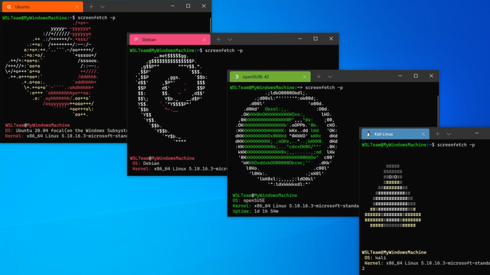

# Windows Subsystem for Linux :penguin:

Install a Linux Distribution of your choice, witout the need of a disk partition.

**Practice Linux on your Windows PC**

Using the following **environment** it is not needed to do the tedious process of:

- [x] ~~Doing a disk partition~~
- [x] ~~Using the GRUB~~
- [x] ~~Selecting a primary operating system~~
- [x] ~~Defining disk sizes~~
- [x] ~~Defining memory for RAM and other processes~~

## How to install ?

To activate the Windows Subsystem for Linux functionality, direct to the following link:

## Distributions

There are different distributions that are accesible for the Windows Subsystem Environemnt:



1. ### Ubuntu 
   - **Easy to manage GUI** and normalized shell, most used distribution accrosss **developers**.
2. ### Centos
   - Used mostly for **networking** and application or **enterprise support** purposes
3. ### Kali
   - Used mostly for **cybersecurity** purposes, availability of being able to customize the operating system

### Ubuntu


## Availability for automation through shell scripts

```shell
#refer to src/main.sh for more information
```